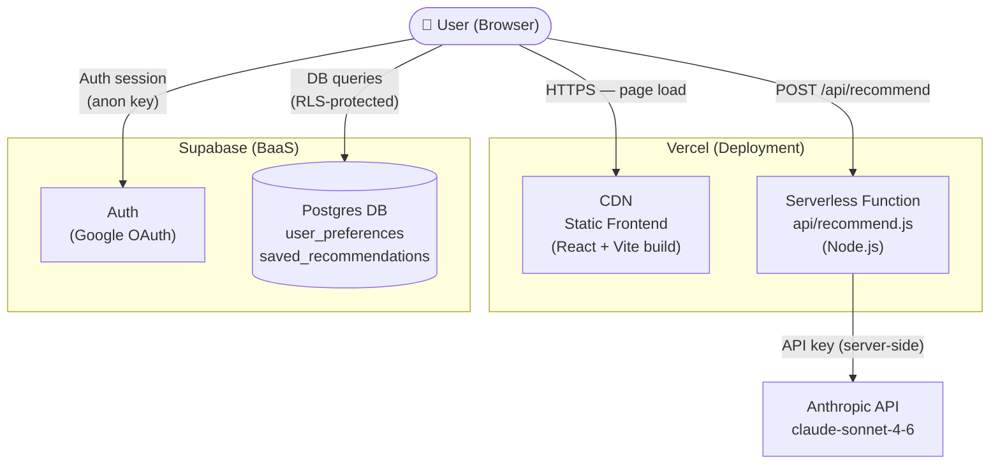
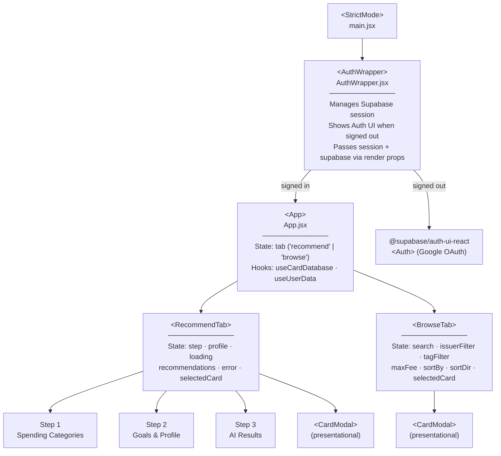
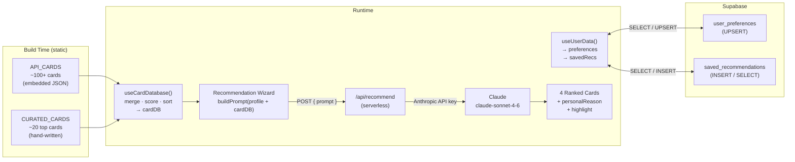
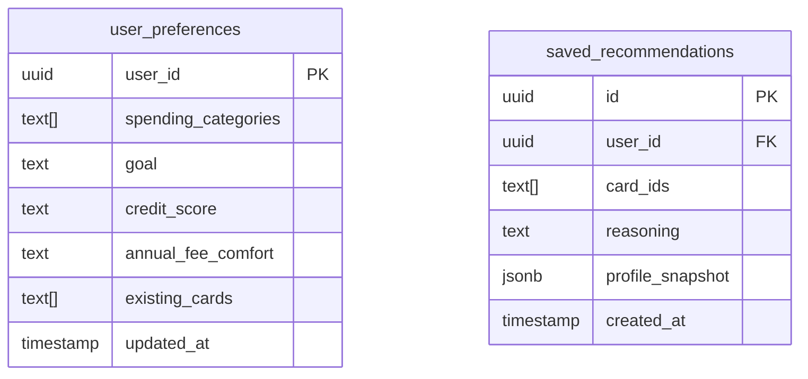

# CardSmith — Architecture

## System Architecture



## Component Hierarchy



## Data Flow



## Technology Stack

| Layer | Choice | Notes |
|---|---|---|
| Frontend | React 19 (JSX) | No TypeScript |
| Build | Vite 7 | ESM output |
| Auth | Supabase Auth + Google OAuth | `@supabase/auth-ui-react` |
| Database | Supabase Postgres | 2 tables: `user_preferences`, `saved_recommendations` |
| AI | Anthropic Claude (`claude-sonnet-4-6`) | Proxied through Vercel serverless |
| Styling | Inline `style` props + injected CSS string | No CSS framework |
| Fonts | Google Fonts (Playfair Display, DM Sans) | |
| Deployment | Vercel | Serverless `api/` + static CDN |
| State | React `useState` / `useMemo` | No external store |
| Routing | None (single `tab` useState) | URL never changes |

## Database Schema



---

# Suggested Improvements

The items below are ordered from highest to lowest impact.

## 1. Split `App.jsx` into focused component files (Critical)

`App.jsx` is ~3,670 lines containing every component, constant, hook, and style in the application. This makes the file extremely difficult to navigate, test, or extend.

**Suggested structure:**

```
src/
├── components/
│   ├── RecommendTab/
│   │   ├── index.jsx          # RecommendTab component
│   │   ├── Step1Spending.jsx
│   │   ├── Step2Profile.jsx
│   │   └── Step3Results.jsx
│   ├── BrowseTab/
│   │   ├── index.jsx
│   │   └── CardTable.jsx
│   └── CardModal.jsx
├── hooks/
│   ├── useCardDatabase.js     # extracted from App.jsx
│   └── useUserData.js         # already separate ✓
├── data/
│   ├── apiCards.js            # API_CARDS constant
│   └── curatedCards.js        # CURATED_CARDS constant
├── styles/
│   └── globalStyles.js        # GLOBAL_STYLES constant
├── supabase.js                # already separate ✓
├── AuthWrapper.jsx            # already separate ✓
├── App.jsx                    # thin root ~50 lines
└── main.jsx                   # already fine ✓
```

## 2. Add URL-based routing

Currently the URL never changes. Users can't bookmark or share a specific card or their results, and the browser back button doesn't work within the app.

Recommendation: add **React Router v7** with routes like:

```
/                → RecommendTab (wizard)
/browse          → BrowseTab
/browse/:cardId  → BrowseTab with card modal open
/results         → last recommendation results
```

## 3. Wire up the saved recommendations UI

`useUserData` already implements `savePreferences` and `saveRecommendation`, and the Supabase tables exist — but no UI calls them. Users currently lose their results every time they reload. Adding a "Save results" button on Step 3 and a "History" tab would take minimal effort given the backend is already ready.

## 4. Protect the `/api/recommend` endpoint

The serverless function currently accepts any POST request from anywhere with no authentication check. This exposes your Anthropic API key usage to abuse (prompt injection, cost farming).

**Minimum fix:** forward the Supabase JWT from the browser and verify it server-side:

```js
// api/recommend.js
import { createClient } from '@supabase/supabase-js'

const supabase = createClient(process.env.SUPABASE_URL, process.env.SUPABASE_SERVICE_ROLE_KEY)

export default async function handler(req, res) {
  const token = req.headers.authorization?.replace('Bearer ', '')
  const { data: { user }, error } = await supabase.auth.getUser(token)
  if (error || !user) return res.status(401).json({ error: 'Unauthorized' })
  // ... rest of handler
}
```

Consider also adding rate limiting (e.g., 5 requests/user/day) using a `recommendation_count` column in `user_preferences`.

## 5. Add TypeScript

The project already has `@types/react` and `@types/react-dom` installed but uses plain JSX. Migrating to TypeScript would catch type errors at build time and make the codebase much easier to refactor safely.

**The card data objects are especially good candidates** — a `Card` interface would document exactly what fields exist and which are optional across the API vs. curated tiers.

## 6. Add a testing framework

There are no tests. Given the complexity of the card-matching algorithm and the `buildPrompt` function (both of which have subtle bugs waiting to happen), even basic unit tests would add significant safety.

Recommendation: **Vitest** (works with Vite out of the box) + **React Testing Library**.

Priority test targets:
- `calcChurnerRating()` — pure function, easy to unit test
- `buildCardFromAPI()` — pure function
- The card merge/sort logic in `useCardDatabase`
- `buildPrompt()` — verify it includes expected card fields

```bash
npm install -D vitest @testing-library/react @testing-library/jest-dom jsdom
```

## 7. Add a `vercel.json` for explicit configuration

The app relies entirely on Vercel's auto-detection heuristics. Adding a `vercel.json` makes deployments more predictable and lets you set function-level config (e.g., a 30-second timeout for the Claude API call, which can be slow):

```json
{
  "framework": "vite",
  "functions": {
    "api/recommend.js": {
      "maxDuration": 30
    }
  }
}
```

## 8. Reduce Claude prompt token usage

`buildPrompt()` serializes every card in the database into the prompt on every request. With ~100+ cards, this is several thousand tokens per call.

**Better approach:** pre-filter cards on the client based on the user's stated `annualFeeComfort` and `goal` before sending to Claude, then only pass the 20-30 most relevant candidates. This cuts cost and latency while often improving recommendation quality (less noise for the model).

## 9. Allow guest access to the Browse tab

The entire app is gated behind Google sign-in. First-time visitors can't explore the card database without committing to an account. Consider allowing unauthenticated access to `/browse` and only requiring sign-in when the user tries to get AI recommendations or save results.

## 10. Fix the README

The current `README.md` is the default Vite template. Replacing it with real documentation (setup steps, required env vars, database schema setup) will make the project much easier to revisit after a break or share with others.

**Minimum useful README:**

```markdown
# CardSmith

A credit card recommendation app powered by Claude AI.

## Setup

1. Clone and install: `npm install`
2. Create a Supabase project and run the schema below
3. Copy `.env.example` to `.env.local` and fill in values
4. Add `ANTHROPIC_API_KEY` to your Vercel project settings
5. `npm run dev`

## Environment Variables

| Variable | Where used |
|---|---|
| VITE_SUPABASE_URL | Client (Vite) |
| VITE_SUPABASE_ANON_KEY | Client (Vite) |
| ANTHROPIC_API_KEY | Vercel serverless only |

## Database Schema

-- create tables SQL here
```

## Summary

| # | Improvement | Effort | Impact |
|---|---|---|---|
| 1 | Split App.jsx | Medium | Very High |
| 2 | URL routing | Low | High |
| 3 | Save results UI | Low | High |
| 4 | Protect /api/recommend | Low | High (security) |
| 5 | TypeScript | High | High |
| 6 | Testing | Medium | Medium |
| 7 | vercel.json | Very Low | Low |
| 8 | Reduce prompt tokens | Low | Medium |
| 9 | Guest browse access | Low | Medium |
| 10 | Fix README | Very Low | Low |
